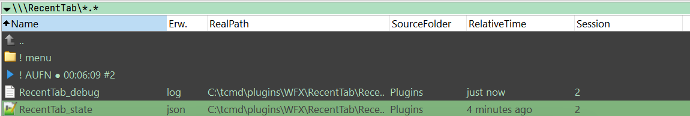
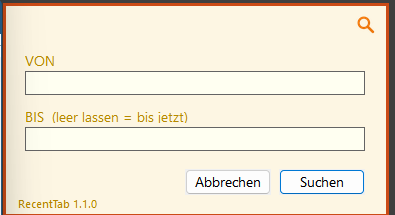

# RecentTab

Плагин файловой системы (WFX) для Total Commander, показывающий
недавно изменённые файлы в виде виртуальной панели - похоже на
вкладку "Недавние" в macOS Finder.


## Что умеет плагин

Открыв `\\RecentTab\` в Total Commander, вы получаете плоский,
хронологический список всех файлов, которые вы недавно
редактировали - собранный со всей системы через прямое подключение к
[Everything](https://www.voidtools.com) (voidtools), без фоновой
службы и без медленного ручного сканирования. Каждый файл в списке -
это настоящий файл на своём настоящем месте: открыть, изменить,
скопировать, переместить, удалить - всё действует прямо на реальный
файл, ничего виртуального или промежуточного. Сама запись - это
простой переключатель вкл/выкл, управляемый мышью прямо в панели, со
своим счётчиком времени. Сама панель остаётся всего из двух пунктов
сверху - `! ЗАП` для этого переключателя и рядом `! menu` для всего
остального (сброс, обновление и поиск ниже) - так что список реальных
файлов никогда не соревнуется за место с рядом кнопок.

Закрыть вкладку, полностью закрыть Total Commander, перезагрузить
компьютер - неважно. История записи хранится в собственном файле
рядом с плагином, не в памяти, поэтому при следующем открытии
`\\RecentTab\` всё останется точно там же - ничего не потеряется из-за
случайного Alt+F4.

Какие папки отслеживаются - решаете вы сами. По умолчанию
отслеживаются шесть привычных (Рабочий стол, Документы, Загрузки,
Изображения, Видео, Музыка), с корректным учётом переадресации
OneDrive, если она у вас есть. Нужно более узкое или совсем другое
множество - например, только диск с проектами? Задайте собственный
белый список папок, и при желании добавьте чёрный список отдельных
подпутей внутри любой из них (папка `node_modules`, кэш резервных
копий - что угодно, что засоряет результаты) - либо оставьте шесть
папок по умолчанию *и* добавьте свои сверху, выбор за вами.
Файлы-заглушки облачной синхронизации, которые ещё не были реально
скачаны (OneDrive Files On-Demand и подобное), отфильтровываются
автоматически.

Всё остальное сделано так, чтобы не мешать и показывать, что
происходит, а не заставлять гадать. Отдельный столбец `RealPath`
всегда показывает настоящее расположение файла, даже если сам список
охватывает много папок. Сортировка по умолчанию - сначала новые (можно
изменить). Alt+Enter открывает окно статистики с цветовой темой -
четыре встроенные палитры, размер окна подстраивается под фактическое
содержимое - с живыми часами прямо в заголовке окна и понятной сводкой
того, что сейчас загружено: какая тема, какой язык, действительно ли
Everything подключён сейчас и какая у него версия, сколько запросов
прошло за эту сессию, полная история записи, и где на диске
действительно находится каждый файл, с которым работает плагин. Ничего
искать не нужно, ничего не спрятано за диалогом настроек - открыл окно,
и всё сразу видно.

Внутри плагин общается с Everything напрямую через его собственный
протокол IPC - без запуска отдельного процесса на каждый запрос, без
командной строки вообще. Заметно быстрее, чем прежний подход этого
проекта. Окно Alt+Enter прямо показывает, действительно ли соединение
сейчас установлено. Сам интерфейс, кстати, доступен более чем на одном
языке, и его несложно дополнить своим переводом.

## Известные ограничения

- Намеренно только для чтения: настройка происходит через прямое
  редактирование `RecentTab.ini`, интерфейса настроек внутри плагина
  нет.
- Учитываются только файлы, которые были действительно изменены или
  созданы заново - не файлы, которые просто открывали/просматривали
  без изменений. Сама Windows не хранит надёжно, *какой процесс*
  затронул файл, только *то*, что он изменился - это жёсткое
  ограничение платформы, а не то, что можно добавить будущим
  обновлением.
- Файл, изменённый в последнюю секунду-две во время активной записи,
  иногда может потребовать ещё одного обновления, прежде чем
  появится - собственному живому индексу Everything нужен небольшой
  момент, чтобы догнать изменения. Пауза (или просто чуть дольше
  подождать) всегда решает это.

---

## Расширенная настройка

У всего ниже есть рабочее значение по умолчанию - этот раздел для
тех, кто хочет донастроить дальше, читать его для начала не
обязательно.

```ini
[Settings]
ConfirmReset=1       ; 0 = сброс сразу, без вопроса "Точно сбросить?"
SortDescending=1     ; 0 = сначала старые вместо сначала новых
Language=eng         ; eng (по умолчанию) / deu / соответствует секции в RecentTab_lang.ini
DebugLogging=1       ; 0 = не писать RecentTab_debug.log (реальные затраты на каждый вызов, пока включено)
IncludeDefaultFolders=0  ; 1 = добавить свои блоки [Watched:...] к шести папкам по умолчанию вместо замены
RootButtons=          ; вынести Reset;Refresh;Search;AutoRefresh на верхний уровень, а не только внутрь "! menu"
UseSearch=1            ; 0 = полностью скрыть поиск, доступа к нему не будет
ShowLiveClock=1        ; 0 = отключить тикающие часы в заголовке Alt+Enter
NoColors=0             ; 1 = везде обычные системные цвета вместо любой темы
FontBrightness=0       ; -3 до +3, тонкая настройка яркости текста темы
BackgroundBrightness=0 ; -3 до +3, тонкая настройка яркости фона темы
AutoRefresh=0          ; 1 = автоматически перечитывать панель вместо Strg+R
AutoRefreshIntervalSec=600  ; актуально только при AutoRefresh=1 - минимум 3с принудительно
;AutoRefreshMaxIdleMin=0     ; 0 = выкл; иначе пропускать автообновление, если система простаивает так долго
MonoFont=fonts\JetBrainsMono-Regular.ttf   ; шрифт полей окна поиска - см. "Встроенные шрифты" ниже
MonoFontName=JetBrains Mono

[Theme]
Name=basic            ; basic (по умолчанию) / gruvbox / everforest / solarized / custom
Mode=dark             ; dark (по умолчанию) / light
```

### Выбор отслеживаемых папок (белый список) и что пропускать внутри них (чёрный список)

Добавьте один или несколько блоков `[Watched:Имя]`, чтобы задать
собственный список - как только появляется хотя бы один, шесть папок
по умолчанию полностью игнорируются, если не установлено
`IncludeDefaultFolders=1`:

```ini
[Watched:Projects]
Path=D:\Projects
Exclude=Backup;node_modules

[Watched:Desktop]
Path=%USERPROFILE%\Desktop
```

`Exclude=` принимает разделённые точкой с запятой фрагменты подпутей,
которые нужно пропускать внутри `Path=` этого блока - ваш чёрный
список для конкретной папки. С `IncludeDefaultFolders=1` ваши
собственные блоки добавляются к шести папкам по умолчанию вместо их
замены (переопределите одну из шести сами, например со своим
`Exclude=`, и будет использована ваша версия вместо простой
стандартной - без дублирования).

### Фильтрация по типу файла

`OnlyExtensions=` — глобальная настройка (действует сразу для всех
отслеживаемых папок):

```ini
[Settings]
;OnlyExtensions=docx;pdf;jpg
```

Принимает `exe`, `*.exe` или `.exe` для каждой записи - как удобнее
написать. Если вообще задан, имеет абсолютный приоритет - показываются
только файлы, соответствующие одному из списка, а любой
`ExcludeExtensions=` (глобальный или для конкретной папки) при этом
полностью игнорируется.

Сам `ExcludeExtensions=` теперь живёт в каждой отслеживаемой папке -
единый глобальный список исключений не мог бы различить две папки с
разным назначением:

```ini
[Watched:Projects]
Path=D:\Projects
ExcludeExtensions=exe;dll
```

### Цветовые темы

Четыре встроенных семейства пресетов - `basic` (по умолчанию),
`gruvbox`, `everforest`, `solarized` - каждое доступно в тёмном и
светлом варианте через `Mode=`:

```ini
[Theme]
Name=basic
Mode=dark             ; dark (по умолчанию) / light
```

(Dracula и Monokai больше не предлагаются как пресеты - ни у одной из
них нет официального светлого варианта в пару к трём остальным;
для Dracula/Monokai-подобного вида используйте `custom` ниже.) Либо
установите `Name=custom` и задайте свои цвета:

```ini
[Theme]
Name=custom
Background=#2b2a27
Foreground=#ede0ce
Heading=#d68f41
Green=#39b81f
Accent2=#00a8c6
Yellow=#ebb626
Accent4=#d63131
Muted=#7a7267
```

Любой оставленный пустым цвет возвращается к соответствующему
значению basic, поэтому неполная своя тема никогда не выглядит
сломанной.

Вместо фиксированного `Mode=` светлая/тёмная тема может следовать за
часами:

```ini
[Theme]
TimeBasedMode=0        ; 1 = игнорировать Mode= выше, решать по часу вместо этого
LightStartHour=6
DarkStartHour=18
```

Значения по умолчанию означают светлую тему с 6:00 до 17:59, тёмную
всё остальное время. Проверяется заново при каждом открытии окна,
поэтому переключается на лету, без перезапуска.

`NoColors=1` в `[Settings]` полностью отменяет любую тему выше -
везде обычные системные цвета (диалог Alt+Enter, окно поиска, и
Menu.exe, когда появится). Каждая роль, которая несёт смысл через
цвет, также сообщает об этом текстом (предупреждения прямо пишут
"WARNING:") - ничего не становится нечитаемым без цвета, только
менее заметным с первого взгляда.

### Язык

Текст интерфейса берётся из `RecentTab_lang.ini` (то же правило
расположения, что и везде), читается собственным UTF-8-безопасным
парсером плагина, а не через `GetPrivateProfileString` Windows
(которая портит нелатинские алфавиты через ANSI-кодовую страницу
системы, если у файла нет BOM UTF-16LE). Поставляется с `eng` и
`deu`; любой пропущенный или пустой ключ автоматически возвращается к
английскому.

`Color_ini_example.ini` показывает третий язык (`rus`, кириллица),
добавленный в файл - образец для копирования секции `[xyz]`, не
загружается автоматически.

### Дополнительные столбцы

Шесть необязательных столбцов, каждый по умолчанию выключен -
включайте только нужные, затем добавьте их на панель через
собственный диалог TC Shift+F1 "Configure custom columns":

```ini
[Settings]
;ShowChangeType=0
;ShowRelativeTime=0
;ShowSourceFolder=0
;ShowSession=0
;ShowOpened=0
;ShowLocked=0
```



**`ShowChangeType`** - плагин уже внутренне решает, что именно
оправдало показ файла: его *изменение* или его *создание* (см.
заметку про `dm:`/`dc:` выше - покрывает архивный случай, когда
старый файл распаковывается с сохранённой датой изменения, но *здесь*
он всё равно новый). Этот столбец просто делает это уже существующее
решение видимым ("Изменён" / "Новый"), вместо того чтобы держать его
чисто внутренним.

**`ShowRelativeTime`** - обычная дата требует момента на осмысление.
"5 минут назад" - нет.

**`ShowSourceFolder`** - полезен только когда настроено больше одного
блока `[Watched:...]`. Без него, чтобы понять, какое правило поймало
файл, пришлось бы читать полный путь самому.

**`ShowSession`** - из какой сессии записи (цикл паузы/продолжения)
пришёл файл - удобно, чтобы отличить "всё с сегодняшнего утра" от
"всё только что", не считая самому по временным меткам.

**`ShowOpened`** - помечает файлы, которые вы уже открывали через эту
панель, значком "x" - удобно при просмотре нескольких совпадений,
чтобы найти ещё не просмотренный. Важное ограничение: это знает
только о файлах, открытых *именно через RecentTab* - было ли что-то
реально отредактировано потом во внешней программе, мы не видим, это
происходит полностью вне видимости плагина (да и сама Windows не
отслеживает это надёжно). Управляется отдельно через
`OpenedTracking=session` (забывается при перезапуске TC, по
умолчанию) или `permanent` (сохраняется между перезапусками, в
собственном небольшом файле `RecentTab_opened.txt`).

**`ShowLocked`** - "Access", "Locked" или "Not found" - удерживает ли
файл сейчас другая программа? Проверяется в фоновом потоке, поэтому
сама панель никогда не ждёт результата - столбец остаётся пустым
недолго, обычно до следующей перерисовки. Проверка действительно
открывает каждый файл в списке для теста, что затрагивает его время
последнего доступа и может разбудить антивирус или облачную
синхронизацию - стоит знать перед включением. Локальные диски
проверяются всегда; сетевые диски, съёмные носители и оптические
приводы по умолчанию выключены (каждый - отдельный round-trip или
диск, которому, возможно, нужно раскрутиться) и включаются по
отдельности через `AllowDriveNetwork=`, `AllowDriveRemovable=`,
`AllowDriveCDRom=`. Файлы-заглушки из облака (OneDrive Files
On-Demand и подобные) полностью пропускаются - никогда не
затрагиваются, так что просмотр никогда не запускает загрузку.

### Свои иконки

Иконку любой записи в панели можно переопределить в `[Icons]` - через
`shell32,<индекс>`, либо через свои `.ico`/`.exe`/`.dll` (относительный
путь вроде `icons\age.ico`, использованный ниже, разрешается
относительно папки этого ini-файла). Оставлено пустым, либо указывает
на то, что не даёт иконку - каждая запись безопасно возвращается к
встроенному значению по умолчанию: ни один жёстко заданный системный
индекс иконки не может быть гарантированно правильным на каждой версии
Windows, так что это настоящий ответ на эту проблему, а не очередное
предположение:

```ini
[Icons]
MenuIcon=icons\menu.ico
AgeIcon=icons\age.ico
```

### Поиск — быстрый поиск в собственной истории

Обычный список показывает всё записанное, но долго прокручивать назад
рано или поздно надоедает. **Поиск** именно для этого: быстрый,
целенаправленный поиск **внутри вашей собственной истории записи** -
не по всему индексу Everything, а только по тому, что вы сами уже
записали, в настроенных папках. Без переключения окон, без обхода
через другое приложение - результат появляется прямо в панели
`\\RecentTab\`, так же как и обычный список.



Находится в `! menu` → `! Search`. Откроется небольшое окно с двумя
полями, **FROM** и **TO** - ввод более гибкий, чем кажется:

- **Двоеточие** делает ваш ввод временем: `17:00`
- **Точка, дефис или косая черта** делает его датой: `04.08.2026`
  (сначала день - 4 августа, не апреля)
- Оба вместе (через пробел) дают точный момент времени:
  `04.08.2026 17:00`
- Дата не указана? Считается **сегодня**.
- Время не указано? FROM по умолчанию - начало дня, TO - конец дня -
  так что дата без времени в TO охватывает весь день.
- Оставьте TO пустым для варианта "**до сейчас**".

`! Назад к недавним файлам` возвращает к обычному виду. `UseSearch=0`
в `[Settings]` полностью скрывает поиск, если он вам вообще не нужен.

### Диалог Alt+Enter

Открывается из `! ЗАП`, `! menu` или любой записи внутри него -
окно статистики с цветовой темой, только для чтения: статус записи с
живыми часами в заголовке окна (`ShowLiveClock=0` их отключает), какая
тема и какой язык сейчас загружены, полная история записи, статистика
за всё время (переживает сброс), действительно ли сейчас установлено
IPC-соединение с Everything и какая у него версия, отслеживаемые папки
(отмечены, если какая-то на самом деле не существует на диске), любая
настройка `[Icons]`, указывающая на файл, который не удалось
загрузить, и пути к файлам конфигурации/состояния. Размер окна
подстраивается под фактическое содержимое, а не фиксирован - растёт
для длинных путей, прокручивается для длинных списков.

### Автообновление - панель обновляется сама, если нужно

По умолчанию выключено. Включите - и панель перечитывает себя по
таймеру, без `Strg+R`:

```ini
[Settings]
AutoRefresh=0
AutoRefreshIntervalSec=600
```

Также переключается на лету из `! menu` → `! Auto-Refresh: ...` -
Enter на этой записи циклически переключает Выкл → 1 → 5 → 10 → 30
минут → Выкл, без правки ini или перезапуска. Этот переключатель в
меню действует только на текущую сессию; значение в ini - это лишь
стартовое значение при загрузке плагина.

Перед каждым срабатыванием проверяется несколько вещей, чтобы в фоне
не происходило ничего неожиданного:

- Срабатывает только пока активная панель действительно показывает
  RecentTab - никогда не перечитывает панель, на которую вы сейчас не
  смотрите
- `AutoRefreshMaxIdleMin=` - пропускает, если система простаивает так
  долго (без движения мыши/клавиатуры, не только TC)

Диалог Alt+Enter показывает, что реально произошло на последнем
тике - не просто "сработало", а удался ли сам запрос данных, нашёл ли
изменения, не нашёл ли ничего нового, или вовсе не удался. Коротко о
причине: простой счётчик тиков показывал бы только, что что-то было
*предпринято*, а не сработало ли это на самом деле - поэтому его
намеренно нет.

### Регуляторы яркости - подстроить тему, не выбирая новые цвета

```ini
[Settings]
FontBrightness=0        ; -3 до +3
BackgroundBrightness=0  ; -3 до +3
```

Семь фиксированных ступеней на каждый регулятор, не свободное число -
`FontBrightness` сдвигает все цвета текста, `BackgroundBrightness`
сдвигает только фон (более узкий диапазон, так как это самая большая
поверхность и она чувствительнее к потере контраста). Если конкретная
комбинация обоих оставит слишком мало контраста между текстом и
фоном, оба значения молча игнорируются, и в диалоге Alt+Enter
появляется предупреждение вместо едва читаемого результата.
Фиксированные, заранее проверенные ступени вместо свободного значения
- по той же причине, по которой сами пресеты тем курируются, а не
произвольны.

### Встроенные шрифты

Поля FROM/TO в окне поиска используют моноширинный шрифт, загружаемый
приватно только для этого процесса - без установки в систему, без
прав администратора, выглядит одинаково независимо от того, что
установлено на конкретной машине. Два шрифта поставляются в папке
`fonts\` (оба под SIL Open Font License, свободно распространяемые):
JetBrains Mono (по умолчанию) и Fira Code.

```ini
[Settings]
MonoFont=fonts\JetBrainsMono-Regular.ttf
MonoFontName=JetBrains Mono
;MonoFont=fonts\FiraCode-Regular.ttf
;MonoFontName=Fira Code
```

Любой другой совместимый моноширинный `.ttf` тоже подойдёт - обе
строки должны соответствовать выбранному файлу: `MonoFont=` - это
путь к файлу, `MonoFontName=` - это внутреннее имя семейства самого
шрифта, которое не всегда совпадает с именем файла. Неверный
`MonoFontName=` не вызывает ошибку или сбой - Windows просто молча
подставляет другой шрифт, и это заметно только по внешнему виду.
Чтобы найти правильное имя для незнакомого файла шрифта: щёлкните по
нему правой кнопкой в Проводнике → Просмотр (или просто дважды
щёлкните) - заголовок окна предпросмотра покажет настоящее имя
семейства.

Чтобы использовать вместо этого Cascadia Code (уже установлен вместе
с Windows, ничего скачивать не нужно): оставьте `MonoFont=` пустым и
укажите `MonoFontName=Cascadia Code`.

### Потерянные файлы - что исчезло, и когда

По умолчанию выключено. Включите - и RecentTab начнёт замечать, когда
что-то отслеживаемое исчезает - удалено, перемещено за пределы
отслеживаемой папки или переименовано выглядят отсюда одинаково,
поэтому никогда не утверждается, что именно произошло, только то, что
что-то произошло:

```ini
[Settings]
TrackLostFiles=0
LostFilesTracking=session
```

Отображается как `! Lost` внутри `! menu`, количество видно в
собственном столбце размера TC. Каждая запись помнит последнее
известное о ней - имя, размер, даты, какая отслеживаемая папка, какая
сессия записи - и при открытии появляется небольшое информационное
окно со всем этим, плюс кнопка "Search again", которая запрашивает у
Everything точное имя файла по всей системе, без ограничения по
папке, на случай если файл просто переместился, а не исчез. Намеренно
не является детектором реального времени - знает только, что
что-то пропало между двумя обновлениями, никогда не точный момент.
Очищается вместе с историей записи при сбросе, а не отдельно. См.
`notes/lost-files/` для более полного обоснования, включая почему два
более амбициозных подхода (живой фоновый наблюдатель, чтение корзины)
были рассмотрены и отклонены.

## Требования

- Windows 7 или новее, Total Commander 32-бит или 64-бит
- [Everything](https://www.voidtools.com) установлен и запущен - плагин
  подключается к нему напрямую через его собственный протокол IPC,
  никакой дополнительной загрузки или настройки не требуется, кроме
  запущенного в фоне Everything

## Файлы в этом пакете

- `RecentTab.wfx` / `RecentTab.wfx64` - сам плагин (TC автоматически
  выбирает нужный, если присутствуют оба)
- `RecentTab.ini`, `RecentTab_lang.ini` - конфигурация и текст
  интерфейса; **должны оставаться в той же папке, что и файл плагина**,
  так как ищутся относительно его собственного расположения, а не
  папки настроек TC
- `Color_ini_example.ini` - образец для добавления ещё одного языка
- `icons\age.ico`, `icons\menu.ico` - иконки по умолчанию для `! Search`
  и `! menu`, подключены через `[Icons]` - в любой момент можно
  заменить на свои, см. раздел "Свои иконки" выше
- `RecentTab_state.json` - создаётся автоматически при первом
  использовании, не входит в этот пакет; хранит историю записи
- `RecentTab_opened.txt` - создаётся автоматически только при
  `ShowOpened=1` и `OpenedTracking=permanent`; хранит, какие файлы
  уже были открыты через панель

## Установка

Дважды щёлкните `RecentTab.zip` прямо в Total Commander - он распознает
установщик внутри и предложит установить автоматически, в один клик.
(Требуется: Конфигурация → Настройки → Упаковщик → "Просматривать
архивы как каталоги" включено, это значение по умолчанию. Если zip уже
открывали для просмотра содержимого в той же панели, откройте/закройте
сначала другой архив, затем щёлкните ещё раз.)

Либо: распакуйте, или возьмите папку `release` из сборки исходного
кода, и дважды щёлкните `pluginst.inf` - или добавьте `.wfx` вручную
через Конфигурация → Настройки → Плагины → Плагины файловой системы
(WFX).

## Сборка из исходного кода

Требуется MinGW-w64 (`build_debug.bat` ожидает `C:\mingw64`, с
необязательной подпапкой `mingw32` для дополнительной 32-битной сборки
рядом с 64-битной). После успешной сборки автоматически собираются
папка `release` и готовый к отправке `RecentTab.zip` рядом со
скриптом. Что проверить после сборки - см. `TESTING.md`.

## Лицензия

MIT - как и у других плагинов этого автора для Total Commander
([XYTags](https://github.com/Native2904), [DescriptEdit](https://github.com/Native2904)).

Автор: Björn ([Native2904](https://github.com/Native2904))
